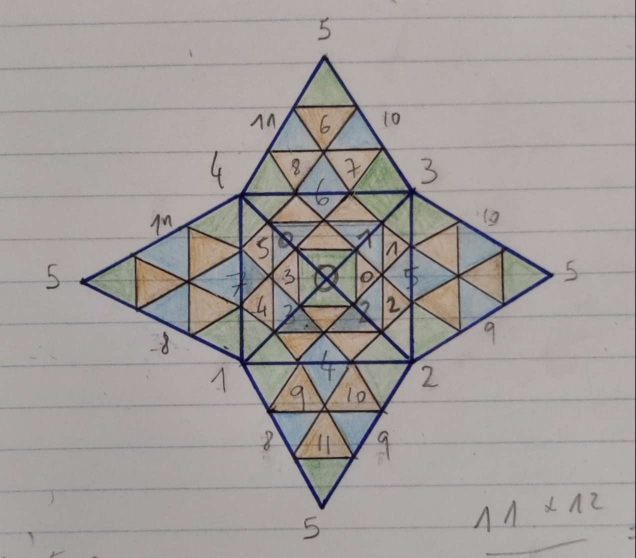

# FTOSearch

Some code for the FTO. Ideally I'd like to have an optimal solver that takes a reasonable amount of time. This is also going to be for computing subgroup distance distributions and probably looking at multi phase solver ideas as well.

Below is the numbering of pieces that I use for defining permutations of pieces. Since the triangles of the second tetrad are equivalent to the first through a z rotation we can use the same numbering and conjugate the moves (e.g. Doing an F move on the second tetrad achieves the same as doing an R move on the first)

## Compiling

This should do the trick if you have a c++ compiler and make installed

make fto

## Running

./obj/fto